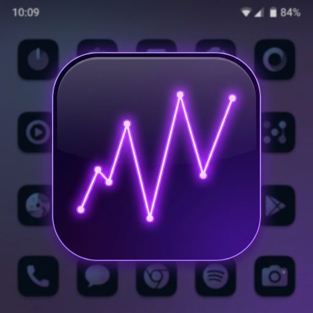

<div align="center">



# Android Task Manager
### A premium system performance monitor with native Dynamic Island integration

[-3DDC84?style=for-the-badge&logo=android&logoColor=white)](https://developer.android.com)
[](https://kotlinlang.org)
[](https://developer.android.com/compose)
[](LICENSE)

</div>

---

## ✨ Features

### 📊 Real-Time System Monitoring
- **CPU Usage** — Per-core and total load
- **RAM / Memory** — Live used/available split
- **FPS Counter** — Frame pacing via `Choreographer`
  
### 🏝️ Native Dynamic Island Integration
Works on **every modern Android phone** — not just Xiaomi:
- **Android 16+** — Promotes to a native Live Update chip in the status bar on all OEM devices
- **HyperOS / MIUI** — Native island integration via the HyperIsland Toolkit
- **Android 8–15** — Falls back to a standard ongoing notification with a live progress bar


---


## ⚙️ Requirements

| Item | Minimum | Recommended |
|------|---------|-------------|
| Android OS | 8.0 (API 26) | 16 (API 36) |
| Dynamic Island | Any Android 16 device | Xiaomi HyperOS 3.0+ |

---

## 🚀 Build & Install

### Build

```bash
git clone https://github.com/gishin05/AndriodTaskManager.git
cd AndriodTaskManager
./gradlew assembleDebug
```

### Install via ADB

```bash
adb install app/build/outputs/apk/debug/app-debug.apk
```

### Or download the pre-built APK from the [Releases](../../releases) page.

---

## 📄 License

```
MIT License — Copyright (c) 2026
Permission is granted to use, copy, modify, and distribute this software.
```

---

<div align="center">

**Built with ❤️ using Kotlin · Jetpack Compose · Android 16**

</div>
